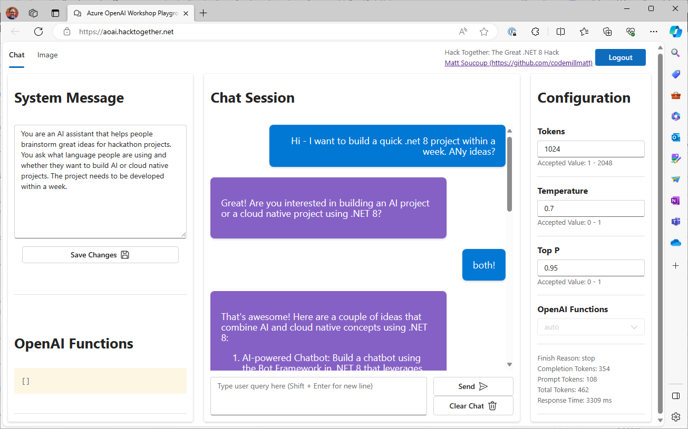

# Hack Together .NET - Limited Access to Azure OpenAI

Hello! Thanks for your interest in hacking on .NET 8 and Azure OpenAI Service. This document is going to help get you up and running with the limited access to Azure OpenAI Service that we're providing as part of the hack!

You won't have direct access to an Azure OpenAI Service instance. Rather you'll go through a proxy. Don't worry - you can still use the same .NET Azure AI SDKs.

## Pre-reqs

1. [Fill out this form - coming soon!]() - we'll take a quick review of it, and then...
1. Wait for an email with the URL to the proxy and your key.

> Note: The key will be activated when the hackathon starts on November 20.

## How to use the proxy

Once you have your key and the proxy's URL, you are almost there. You can use [Azure OpenAI .NET SDK](https://www.nuget.org/packages/Azure.AI.OpenAI/1.0.0-beta.9) in the same way as you normally would - except for a couple of parameter differences when instantiating the client.

For the sake of this document, pretend the proxy's URL is `https://hacktogether.microsoft.com` and pretend your key is `abc123`.

### Instantiate the client

```csharp
string proxyUrl = "https://hacktogether.microsoft.com";
string key = "abc123";

// the full url is appended by /v1/api
Uri proxyUrl = new(proxyUrl + "/v1/api");

// the full key is appended by "/YOUR-GITHUB-ALIAS"
AzureKeyCredential token = new(key + "/YOUR-GITHUB-ALIAS");

// instantiate the client with the "full" values for the url and key/token
OpenAIClient openAIClient = new(proxyUrl, token);
```

### Model Deployments

Whether you are generating completions, chat completions or embeddings - you will need to provide a deployment name. We have provided some for you in the proxy.

* **Chat completions:** `gpt-35-turbo`
* **Embeddings:** `text-embedding-ada-002`
* **Completions:** `davinci-002`

So if we were going to use chat completions our code would look like:

```csharp
ChatCompletionsOptions completionOptions = new() {
    MaxTokens=2048,
    Temperature=0.7f,
    NucleusSamplingFactor= 0.95f,
    DeploymentName = "gpt-35-turbo"
};

completionOptions.Messages.Add(new ChatMessage(ChatRole.System, "you are a helpful tax accountant and want to lower everybody's taxes."));
completionOptions.Messages.Add(new ChatMessage(ChatRole.User, "hi there"));

var response = await openAIClient.GetChatCompletionsAsync(completionOptions);
```

The proxy also supports image generation using the DALL-E 2 model.

### That's it!

Using the SDK is the same as before. You only need to note the proxy's URL and your key, both of which we will send to you. Also make sure you properly append the values to the URL and key as demo'd above.

You're limited to the model deployments listed above. Make sure you use the name exactly as specified.

## How to use the playground

Want to play around with the system message and the prompts before creating your app? We've built a playground you can use to prototype your idea out to make sure it works as expected before you spend too much time coding.

To use it go to: `https://aoai.hacktogether.com`.

That will load up a website that looks like this:


In the upper right corner there's a text box for an **API Key**. Enter the key you were sent in your registration email followed by a forward slash followed by your GitHub username. It will look something like this:

    > this-will-be-a-guid/codemillmatt

It will log you in and you'll be able to fine tune various settings so you don't have to mess around your code to see the results. Rapid prototyping at it's best!

Here we changed the system prompt and started asking it to brainstorm some hackathon projects.



From here you can tweak the temperature, top P, and so on. And see how many tokens your requests use. Remember to use this responsibly.

## Good luck!

Good luck! We have plenty of [learning materials available](https://github.com/microsoft/Hack-Together-DotNet#ai-1) for you to learn more.
